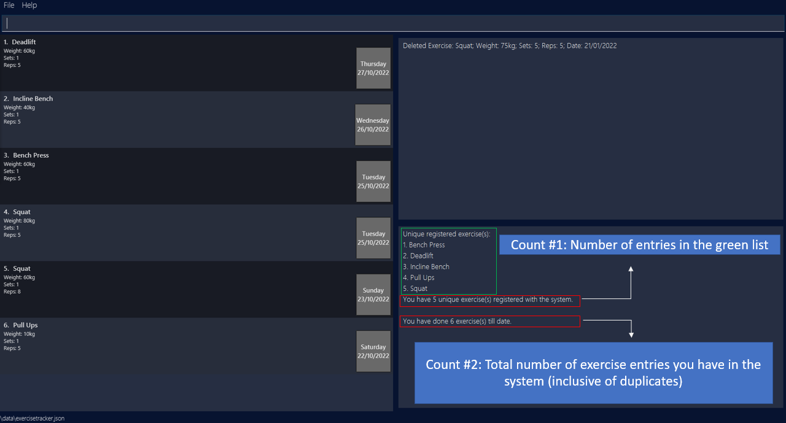
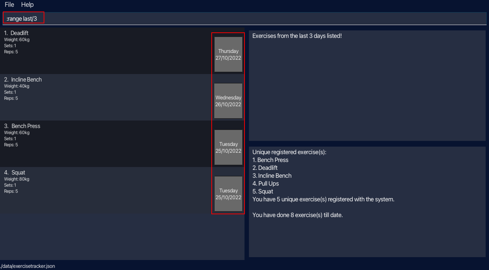

Gim is a **desktop app for managing and tracking gym exercises, optimized for use via a Command Line Interface (CLI)** while still having the benefits of a Graphical User Interface (GUI). Gim commands are inspired by those of Vim. If you are an avid Vim user and can type fast, Gim can help you keep track of your workouts and personal records for each exercise. Gim can also help you to craft a workout based on your personal records.

### Table of Contents
#### Getting Started
#### GUI Orientation
* Exercise List 
* Result Display 
* Recognised Exercise Names List

#### Commands
* Adding an exercise **:add**
* Deleting an exercise **:delete**
* Listing all exercises **:list**
* Sorting all exercises **:sort**
* Viewing all exercises within a time period **:range**
* Viewing help **:help**
* Exiting the program **:wq**

#### Command Summary
#### Glossary of Terminologies

--------------------------------------------------------------------------------------------------------------------

## Quick start

1. Ensure you have Java `11` or above installed in your Computer.

2. Download the latest `gim.jar` from [here](https://github.com/AY2223S1-CS2103T-T15-4/tp/releases).

3. Copy the file to the folder you want to use as the _home folder_ for your Gim.

4. Double-click the file to start the app. The GUI similar to the below should appear in a few seconds. Note how the app contains some sample data. 
    

5. Type the command in the command box and press Enter to execute it. e.g. typing **`help`** and pressing Enter will open the help window. 

6. Refer to the [Features](#features) below for details of each command.

--------------------------------------------------------------------------------------------------------------------

## GUI Orientation 

### Exercise List

The `Exercise List Window` displays the latest input exercise (by the user) at the top of the list by default. All exercises
added will be displayed in the list. The list may morph or reorder depending on the command issued by the user.

### Result Display 

The `Result Display Window` displays feedback after executing a command. It gives feedback to the user on the command executed.

### Recognised Exercise Name List

The `Recognised Exercise Name List Window` provides you a list of all unique exercise names that are currently registered 
with the system. 
  This list updates in real time and allows you to quickly keep track of the exercises you have input in the 
past. Hence, even if the exercise list is populated, the `Recognised Exercise Name List Window` helps you in keeping track of 
what you named your exercises so that your entries are consistent. It also helps you to identify any wrong spellings in the name 
of the exercises you have input.

* The Recognised Exercises count provides the number of unique exercises registered with the system. 
* The Exercise List Entries count provide the number of entries in the `Exercise List Window`. 
  
#### Adding and Deleting from the Exercise Name List

The `Recognised Exercise Name List Window` is generated based on the state of the Exercise List. Hence, by adding and deleting 
to the Exercise List, the Recognised Exercise Name List is automatically updated.

:exclamation: **Caution:** 
Exercise names are recognised as equal if their lower-cased, white-spaces removed forms are the same.   
I.E. "Bench Press", "BENCH PRESS", "BenchPress" will be logged as the same exercise for your convenience in adding.  
However, the first time you add an exercise with a unrecognised name, the Recognised Exercise Name List will save the form 
you have input. Choose wisely!

--------------------------------------------------------------------------------------------------------------------
## Features

### Viewing help : `:help`

Access the help menu, containing a brief summary of the commands supported. The help menu also provides a link to the 
user guide.

Format: `:help`

### Adding an exercise: `:a`

Adds an exercise that we have done for the day.

Format: `:a n/<exercise name> w/<weight(kg)> s/<sets> r/<reps>`

##### Parameter constraints:
* The weight **must be a positive decimal number**
  * Examples: 1, 1.5, 2, ...
* The sets **must be a positive integer, up to 3 digits, with no leading zeros**
  * Examples: 1, 2, 3, 10, 100...
* The reps **must be a positive integer, up to 3 digits, with no leading zeros**
  * Examples: 1, 2, 3, 10, 100...

##### Examples:
* `:a n/Squat w/30 s/3 r/5` Adds a squat exercise of weight 30kg for 3 sets of 5 reps

### Deleting an exercise : `:d`

Deletes a particular exercise from our list. The index refers to the index number shown in the displayed exercise list.

Format: `:d <index>`

##### Parameter constraints:
* The index must be a positive integer 1, 2, 3, ...

##### Examples:
* `:d 3` Deletes an exercise at index 3 of the list

### Listing all exercises : `:ls`

Shows a list of all exercises.

Format: `:ls`

### Sorting all exercises : `:sort`

Sorts the list of exercises according to their date of completion, with the latest exercise completed displayed at the top of the list.

Format: `:sort`

### Viewing all exercises within a time period : `:range`

Shows a list of all exercises within a date range, in sorted order.
The order is based on latest to oldest date, then by alphabetical order of exercise name.

Format (1) : `:range d/<start date> e/<end date>`

Example: `:range d/25/10/2022 e/26/10/2022` shows the exercises done between October 20, 2022 
and October 25, 2022 (both inclusive)

Format (2) : `:range last/<number of days>`

Example: `:range last/3` shows the exercises done today and the last 3 days

### Exiting the program : `:wq`

Exits the program.

Format: `:wq`

--------------------------------------------------------------------------------------------------------------------

## FAQ

**Q**: What is the use of the :list command? 
 
**A**: The List command is used to make the Exercise List display all exercises after a Exercise List morphing command 
such as Find or Range has been executed. 

**Q**: How do I change the way an exercise is stored and displayed?
 
**A**: The way you format the exercise name when you first add it will be the way it is displayed in the system. After that,
all exercises added that have the [same defined name](#Adding-and-Deleting-from-the-Exercise-Name-List) will be grouped under the same exercise and generate the same exercise card. 
To change the way it is represented, you can find the exercise with the name, delete the entries and re-enter the exercises. 

**Q**: Can I edit an exercise?
 
**A**: You can do so by deleting the entry and adding a new entry. 

--------------------------------------------------------------------------------------------------------------------

## Command Summary

| Action              | Format                                           | Examples                         |
|---------------------|--------------------------------------------------|----------------------------------|
| **Add exercise**    | :a n/<exercise> w/<weight(kg)> s/<sets> r/<reps> | :a n/Squat w/60 s/5 r/5          |
| **Delete exercise** | :d <index>                                       | :d 3                             |
| **List exercises**  | :ls                                              | :ls                              |
| **Sort exercises**  | :sort                                            | :sort                            |
| **View range (1)**  | :range d/<start_date> e/<end_date>               | :range d/10/10/2022 e/15/10/2022 |
| **View range (2)**  | :range last/<number_of_days>                     | :range last/3                    |
| **Help menu**       | :help                                            | :help                            |
| **Exit program**    | :wq                                              | :wq                              |

--------------------------------------------------------------------------------------------------------------------

## Glossary of Terminologies
* **Vim**: A Unix text editor, known for being lightweight, fast and efficient. It can be controlled entirely with the keyboard with no need for menus or a mouse.
* **Exercise** : Physical activity done in a regular gym that is structured and repetitive, usually involving
some weights.
* **Reps** : Number of times you perform a specific exercise
* **Sets** : Number of cycles of reps that you complete
* **Weight**: Total weight (include barbell if applicable, exclude body weight)

