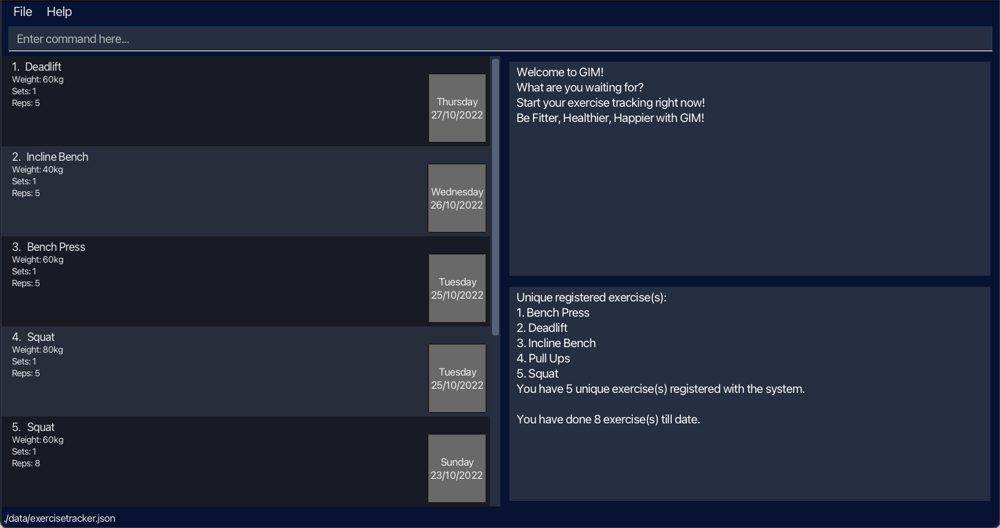

---
#GIM User Guide

---

Gim is a **desktop app for managing gym exercises, optimized for use via a Command Line Interface (CLI)** while still having the benefits of a Graphical User Interface (GUI). Gim builds on the commands of Vim so if you can type fast and are an avid Vim user, Gim can optimize your exercise routines to a much greater capacity than traditional GUI apps.

###Table of Contents
####Getting Started 
####Features
* Adding an exercise **:a**
* Deleting an exercise **:d**	
* Listing all exercises **:ls**
####Command Summary
####Glossary of Terminologies

--------------------------------------------------------------------------------------------------------------------

## Quick start

1. Ensure you have Java `11` or above installed in your Computer.

1. Download the latest `gim.jar` from [here](https://github.com/se-edu/addressbook-level3/releases).

1. Copy the file to the folder you want to use as the _home folder_ for your Gim.

1. Double-click the file to start the app. The GUI similar to the below should appear in a few seconds. Note how the app contains some sample data. 
   

1. Type the command in the command box and press Enter to execute it. e.g. typing **`help`** and pressing Enter will open the help window. 

1. Refer to the [Features](#features) below for details of each command.

--------------------------------------------------------------------------------------------------------------------

## Features

### Viewing help : `help`

Access the help menu, containing the information about the commands.

Format: `:help`

### Adding an exercise: `:a`

Adds an exercise that we have done for the day.

Format: `:a <exercise name> <weight(kg)> <sets> <reps>`

Parameter constraints:
* The weight **must be a positive decimal number**
  * Examples: 1, 1.5, 2, ... 
* The sets **must be a positive integer**
  * Examples: 1, 2, 3, ...
* The reps **must be a positive integer**
  * Examples: 1, 2, 3, ...

Examples:
* `:a Squat 30 3 5` Adds a squat exercise of weight 30kg for 3 sets of 5 reps

### Listing all exercises : `list`

Shows a list of all exercises.

Format: `:ls`

### Editing a person : `edit`

Edits an existing person in the address book.

Format: `edit INDEX [n/NAME] [p/PHONE] [e/EMAIL] [a/ADDRESS] [t/TAG]…​`

* Edits the person at the specified `INDEX`. The index refers to the index number shown in the displayed person list. The index **must be a positive integer** 1, 2, 3, …​
* At least one of the optional fields must be provided.
* Existing values will be updated to the input values.
* When editing tags, the existing tags of the person will be removed i.e adding of tags is not cumulative.
* You can remove all the person’s tags by typing `t/` without
    specifying any tags after it.

Examples:
*  `edit 1 p/91234567 e/johndoe@example.com` Edits the phone number and email address of the 1st person to be `91234567` and `johndoe@example.com` respectively.
*  `edit 2 n/Betsy Crower t/` Edits the name of the 2nd person to be `Betsy Crower` and clears all existing tags.

### Locating persons by name: `find`

Finds persons whose names contain any of the given keywords.

Format: `find KEYWORD [MORE_KEYWORDS]`

* The search is case-insensitive. e.g `hans` will match `Hans`
* The order of the keywords does not matter. e.g. `Hans Bo` will match `Bo Hans`
* Only the name is searched.
* Only full words will be matched e.g. `Han` will not match `Hans`
* Persons matching at least one keyword will be returned (i.e. `OR` search).
  e.g. `Hans Bo` will return `Hans Gruber`, `Bo Yang`

Examples:
* `find John` returns `john` and `John Doe`
* `find alex david` returns `Alex Yeoh`, `David Li` 
  

### Deleting an exercise : `:d`

Deletes a particular exercise from our list. The index refers to the index number shown in the displayed exercise list.

Format: `:d <index>`

Parameter constraints:
* The index must be a positive integer 1, 2, 3, ...

Examples:
* `:d 3` Deletes an exercise at index 3 of the list

### Clearing all entries : `clear`

Clears all entries from the address book.

Format: `clear`

### Exiting the program : `:wq`

Exits the program.

Format: `exit`

### Saving the data

AddressBook data are saved in the hard disk automatically after any command that changes the data. There is no need to save manually.

### Editing the data file

AddressBook data are saved as a JSON file `[JAR file location]/data/addressbook.json`. Advanced users are welcome to update data directly by editing that data file.

:exclamation: **Caution:**
If your changes to the data file makes its format invalid, AddressBook will discard all data and start with an empty data file at the next run.

### Archiving data files `[coming in v2.0]`

_Details coming soon ..._

--------------------------------------------------------------------------------------------------------------------

## FAQ

**Q**: How do I transfer my data to another Computer? 
**A**: Install the app in the other computer and overwrite the empty data file it creates with the file that contains the data of your previous AddressBook home folder.

--------------------------------------------------------------------------------------------------------------------

## Command summary

| Action              | Format                                   | Examples        |
|---------------------|------------------------------------------|-----------------|
| **Add exercise**    | :a <exercise> <weight(kg)> <sets> <reps> | :a squat 60 5 5 |
| **Delete exercise** | :d <index>                               | :d 3            |
| **List exercises**  | :ls                                      | :ls             |
| **Help menu**       | :help                                    | :help           |
| **Exit program**    | :wq                                      | :wq             |

--------------------------------------------------------------------------------------------------------------------

## Glossary of Terminologies 
* Exercise : Activity requiring physical effort, carried out to sustain or improve health and fitness
* Reps: Number of times you perform a specific exercise 
* Sets: Number of cycles of reps that you complete 